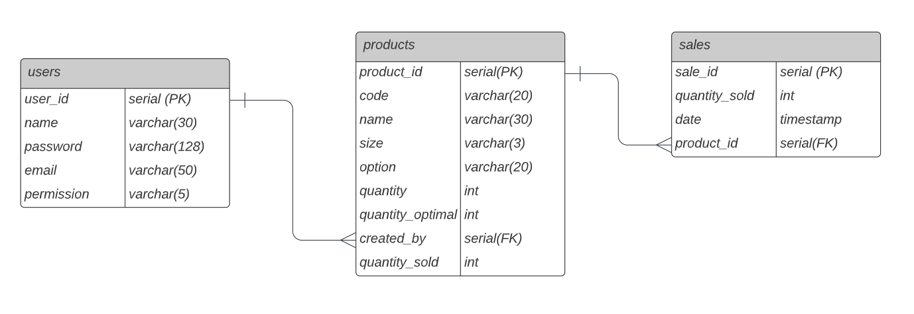
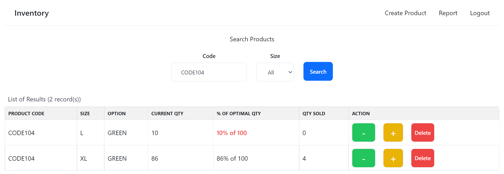
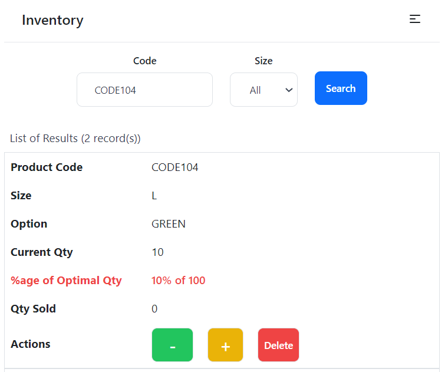

# inventory

Fullstack Application built with the PostgreSQL, Express, ReactJS and NodeJS (PERN) stack. JSON Web Token is used for user validation and styling done using Tailwind CSS.

Access to app will be provided once deployed.

### Possible Use Case
A stocktaking app targeted at neighbourhood shop with the following characteristics:
- Require simple stocktake system
- Infancy stage of technology adoption
- Customer base not on e-commerce platform
- Does not yet have any barcode system
- Staff mainly seniors using mobile (i.e. app has to be simple and mobile responsive)

### Motivation
Through this capstone project, I hope to:
- ReactJS: make a more conscious effort to include reusable components (e.g. button, input, dropdown, etc) for the frontend
- Express & PostgreSQL: recap on the use of Express (e.g. organise endpoints under different controllers) and learn how Express communicate with a SQL database. Gain an idea of how JWT token works with Express for user validation.
- PostgreSQL: practice data modelling and use of SQL for the various endpoints to create, read, update and delete (CRUD) data.

### Approach
 1. [Figma wireframe](https://www.figma.com/file/DX7BSDh7fJHDqn5G6TrD9m/Project-4?node-id=0%3A1) was used for planning of features
2. Based on brief idea of required features, identified data required and database design
   

List of available [endpoints](https://docs.google.com/spreadsheets/d/1GX5WLTCAC3pTVwTrhteLhfgTpHg6ivFIWJyvFDzNUAo/edit?usp=sharing) created for the app

### Features
- When not **login**, users will be redirected to the login page if they enter url of the landing page
- Validation during **registration** include checking that there is no account with same email and meet password complexity criteria.
- Landing page is defaulted to the **Search** Product page where users can search by product code and size (dropdown list)
- Records will then be retrieved with options for users to update sale, restock or delete product. 
- To make it easy for seniors to relate to what each button does, minus and plus sign as well as primary colours (green, yellow and red) is used. 
- Result list is designed to be mobile responsive as shown in the below screenshots.
Desktop View  
Mobile view 
- Users can **update** a sale by clicking the **minus** green button. After clicked, quantity will reduce by 1 and quantity sold will increase by 1. At the same time, an entry will be created in the sales table to record timestamp of the sale.
- When quantity =< 20% of optimal quantity, the text under that column will turn red to alert it's time to restock. 
- When stock arrives, users can click on the **plus** yellow button to add quantity in bulk. There's a validation to ensure the number input is > 0.
- There are 2 levels of permissions (i.e. staff and supervisor).
Only account with supervisor permission can Create and Delete products. 
- Supervisor can **create** a new product if not already exist in the db. There is a validation by checking that the product code, size and option does not match any entry in the db before a new entry is added.
- Validation is added to ensure only product with no sales record can be **deleted**.
- The **Report** option allows users to retrieve sales record by date range* which will return 2 views (**Summary** - summary of total sales for each product for the selected sorted by in descending order to reflect product with top sales first in the row; **Details** - listing the details of the date and time the sales took place for possible monitoring time of sales). 

*(disabled selection of future dates for Report date range; for 2nd date selection, disabled dates earlier than first date)*

[Screenshots](https://docs.google.com/presentation/d/1uTPHRD0GLC7LUQnHgoRuFr7BBENSuVGEsZUAW13xJcY/edit?usp=sharing) of app features

### Possible Further Enhancement
- Allow dynamic addition of size not already in dropdown list
- Allow updating of other data field (e.g. optimal option)
- Allow export of report to excel
- Further refactoring of the codes
