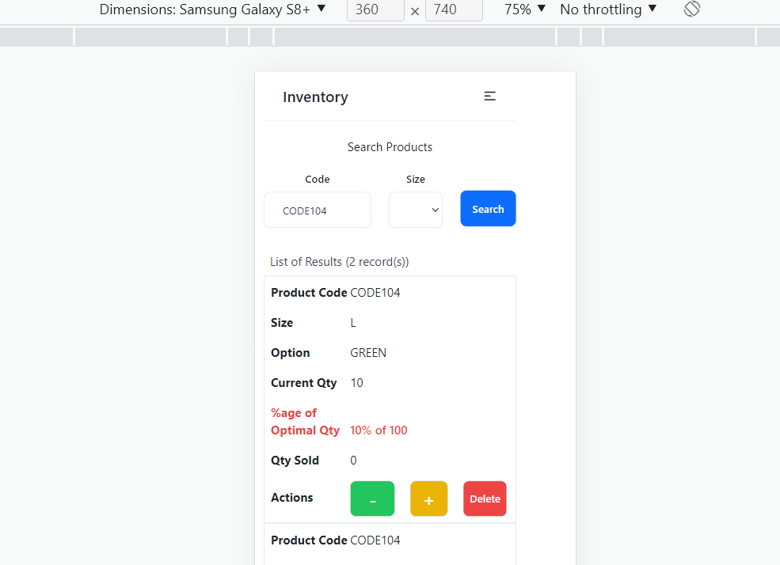

# inventory

Fullstack Application built with the PostgreSQL, Express, ReactJS and NodeJS (PERN) stack. JSON Web Token is used for user validation and styling done using Tailwind CSS.

### Possible Use Case
A stocktaking app targeted at neighbourhood shop with the following characteristics:
- Require simple stocktake system
- Infancy stage of technology adoption
- Customer base not on e-commerce platform
- Does not yet have any barcode system
- Staff mainly seniors using mobile (i.e. app has to be simple and mobile responsive)

### Motivation
Through this capstone project, I hope to:
- ReactJS: make a more conscious effort to include reusable components (e.g. button, input, dropdown, etc) for the frontend
- Express & PostgreSQL: recap on the use of Express (e.g. organise endpoints under different controllers) and learn how Express communicate with a SQL database. Gain an idea of how JWT token works with Express for user validation.
- PostgreSQL: practice data modelling and use of SQL for the various endpoints to create, read, update and delete (CRUD) data.

### Approach
 1. [Figma wireframe](https://www.figma.com/file/DX7BSDh7fJHDqn5G6TrD9m/Project-4?node-id=0%3A1) was used for planning of features
2. Based on brief idea of required features, identified data required and database design
   

List of available [endpoints](https://docs.google.com/spreadsheets/d/1GX5WLTCAC3pTVwTrhteLhfgTpHg6ivFIWJyvFDzNUAo/edit?usp=sharing) created for the app

### Features
- When not login, users will be redirected to the login page if they enter url of the landing page
- Landing page is defaulted to the Search Product page where users can search by product code and size (dropdown list)
- Records will then be retrieved with options for users to update sale, restock or delete product. To make it easy for seniors to relate to what each button does, minus and plus sign as well as primary colours (green, yellow and red) is used. 
- Result list is designed to be mobile responsive.
Desktop View  
Mobile view 

There are 2 levels of permissions (i.e. staff and supervisor).
Only account with supervisor permission can Create and Delete products. 

### Possible Further Enhancement
- Allow dynamic addition of size not already in dropdown list
- Allow updating of other data field (e.g. optimal option)
- Allow export of report to excel
